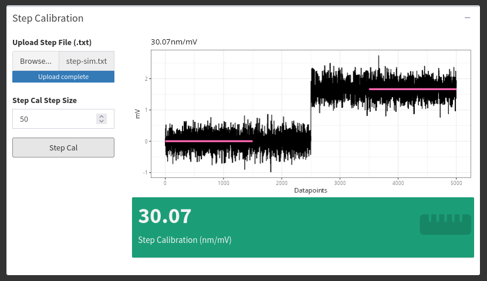
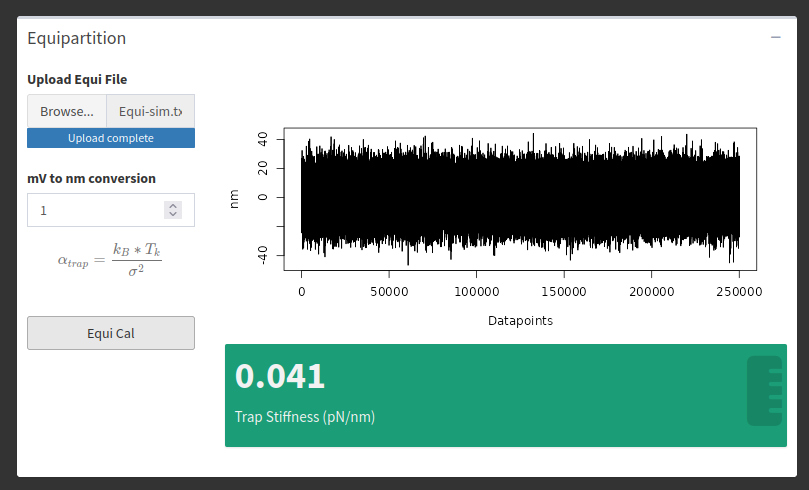

# Calibrations

There are two "offline" calibrations analyzers in *lasertrapr*. They are considered "offline" because they are used to calculate the calibration factors after a trapping session and not during data collection. They cannot integrate into the actual trapping system. To use these analyzers, you must perform the calibration routine, save, and export data from your optical trapping system. Then upload the data into *lasertrapr*.

## Step Calibration

If you are using a quadrant photo detector (QPD) on your optical trap, the raw data you are collecting is a voltage signal. For this data to be meaningful, you need to turn the voltage signal into distance units. To do this, you can use the "Step Calibration": Stick a microsphere on or under a nitrocellulose surface and then place the bead within the linear range of the QPD. Move the stage a known distance (e.g. 50 nanometers). There will be a relative voltage change in this signal. Save the data segment that has the relative shift.

Upload this data into *lasertrapr* as a plain text format file (csv/txt) into the "Step Calibration" calculator within "Upload Data" tab. The calculator will extract the data in the first column. Input the distance you moved the stage. Click the button. The calculator will identify the displacement with a single changepoint algorithm and calculate the average position of the two segments. It will then return a volts-to-nanometer conversion factor. The app will calculate the average position over the course of 1000 datapoints from the start of the 2 changepoint identified segments. Please let me know if you want to alter this time segment or input your own. Example:

The calculation is simple. If you move something a known distance (e.g. 50 nm), and the signal changed from -1 to +2 volts, there is a 3 volts to 50 nm ratio (e.g. 16.6 nm per volt). You can now use this value to convert your other data from volts to nanometers. 

## Equipartition

If you want to measure forces in an optical trap, you need to perform additional calibrations to convert your data from nanometers to volts. This can be done via the Equipartition Method, which uses the variance of a baseline trapping signal to quantify stiffness (piconewtons/nanometer). On your optical trap, trap a microsphere, and save a few seconds of baseline data. Upload this data as a plain text file (csv/txt) into the "Equipartition" calculator under the "Upload Data" tab. The calculator data will automatically select the first column of data to use for the analysis. Click the button. The analyzer will calculate the variance of the trapping trace and perform the Equipartition calculation and output a stiffness value in pN/nm that can be used for further analysis of your data.

