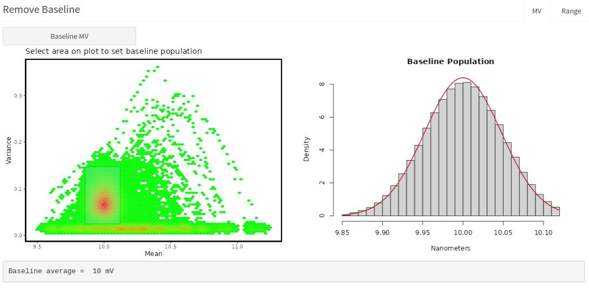
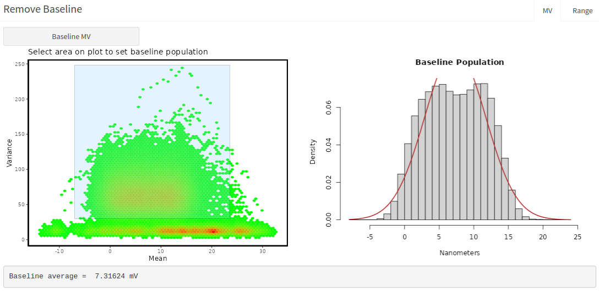
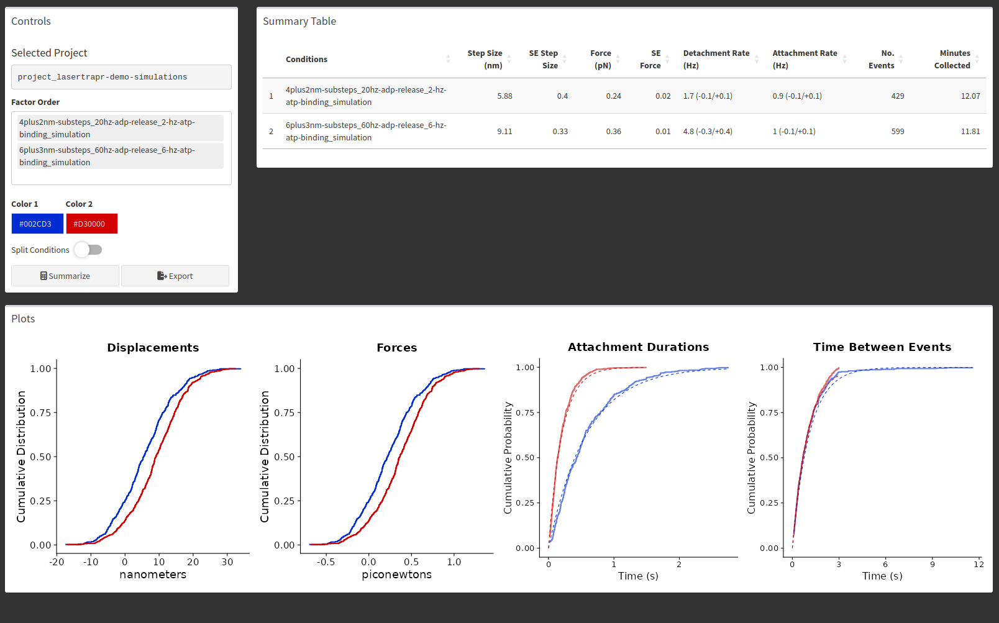
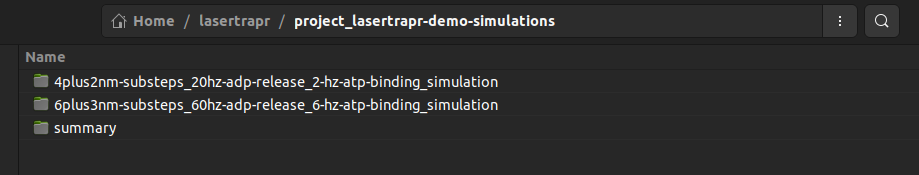
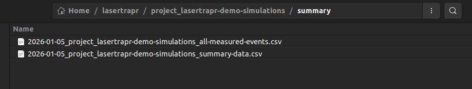
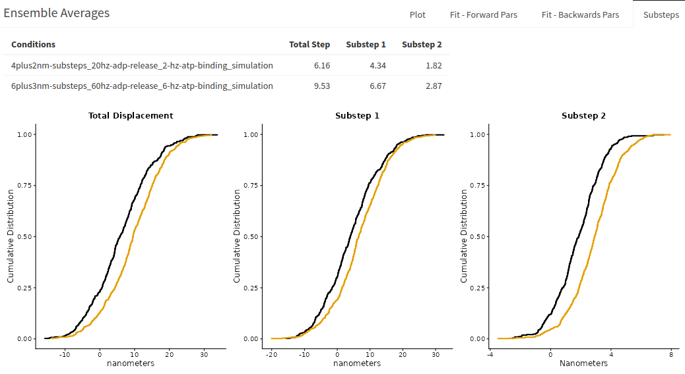
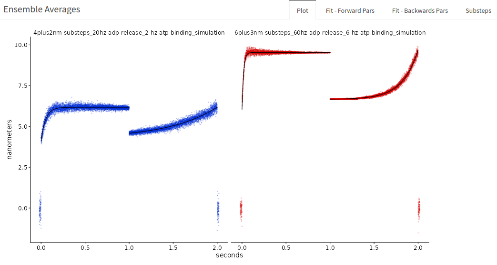
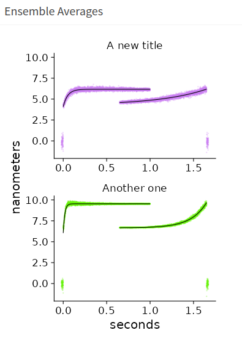

--- 
title: "Documentation for **{lasertrapr}**"
author: "Brent Scott"
date: "`r Sys.Date()`"
site: bookdown::bookdown_site
documentclass: book
bibliography:
- book.bib
- packages.bib
biblio-style: apalike
link-citations: yes
description: Documentation for using the lasertrapr app
---

# Getting Started
  
**{lasertrapr}** is an R-package/Shiny application built using the [`{golem}`](https://golemverse.org/) framework for automating the analysis of laser trap data. Please note that the app is currently still under development. Users should proceed with caution. 
 
*NOTE: an R-package is denoted by the `{}` braces* 

## Install R & RStudio

Currently, **{lasertrapr}** can only be launched from an active R-session. Before you begin you will need to [download and install R](https://cloud.r-project.org/) and optionally [RStudio](https://www.rstudio.com/products/rstudio/download/#download). Both of these are free. RStudio is an IDE (integrated development environment) and is not 100% necessary but is recommended if you are new to R. Follow the instructions on the respective websites to complete installation. 

Additionally, you will need to install the [R build toolchain](https://r-pkgs.org/setup.html#setup-tools). This allows a user to build an R-package from source on their own computer which is necessary to build this application since it is an R package. The link provides directions on how to do this on Windows, Mac, and Linux. 

## Download **{lasertrapr}**

Open R/RStudio on your computer. 

For users that want the latest developmental version, users who are reviewing, or users who want to contribute you can install the latest from GitHub with: 
```{r eval=FALSE}
install.packages("pak") 
library(pak) # loads the package
pkg_install("brentscott93/lasertrapr") # downloads lasertraor from github
```


You can download and older archived version from 2022 from my *drat* repository on Github with the following code. This was the version presented in my dissertation so I keep this version archived so the instructions/analyses can be replicated as described. Copy/paste the following into the R-Console or into an R-Script to run:  
```{r eval=FALSE}
install.packages("drat") # installs drat package
drat::addRepo("brentscott93") # adds my drat repo
install.packages("lasertrapr") # installs the lasertrapr package
```

Both {pak} and {lasertrapr} will need to install dependencies. Update and install all the packages that they want when prompted. Alternatively, you can install {pak} from within the RStudio IDE by navigating to the "Packages" tab in the lower right box and clicking "Install".

## Launch the App

Once your have successfully installed and built the `{lasertrapr}` package, you are ready for launch:

```{r, eval = FALSE}
library(lasertrapr) # load the package and its dependencies
run_app() # this will launch the app GUI in your default web browser
```

Once the initial setup and installation is complete, the above two lines is the only code that will need to be run each time you want to use the app. You can update to the current developers version anytime by re-running `install.packages("lasertrapr")` or `pak::pkg_install("brentscott93/lasertrapr")`. 

## Get tutorial data

There are several tutorial datasets you can play with to learn the layout of the application before trying to upload your own. Also, you can always simulate new datasets as well to play with. [There is a google drive folder here with tutorial datasets](https://drive.google.com/drive/folders/1-EzrJrbWvC_sFsRJSm-_uDBchppeqvae?usp=sharing). Take note of how the data are formatted as this can help if you run into problems uploading your own data later.

### Demo project

#### Get data

A *lasertrapr* compatible "project" folder is zipped on the drive. Download "project_lasertrapr-demo-simulations.zip". On first start of the *lasertrapr* program, it will create a "lasertrapr" folder on your computer. On windows, this is usually under Documents -> lasertrapr. On MacOS or Linux its just under your home directory.

Unzip "project_lasertrapr-demo-simulations.zip" into your lasertrapr folder. It should be lasertrapr -> project_lasertrapr-demo-simulation. Launch the app, you should now have a project to select called "project_lasertrapr-demo-simulation" in your folder manager.

This demo project was made to highlight the user-friendly features of the app which allow for easy processing of real experimental data. The data is all simulated in this project.

#### Clean & Process

Navigate to "Clean & Process". Select the condition that start with "4plus2". Then Date = "2026-01-02". Then "obs-01" in the folder manager. Click "graph". An interactive graph will appear in the "Data Trace" box.

This trace was generated so it looks like an actin filament "snapping". You cannot anticipate this happening so this "snapping" is always saved while you are collecting data and it should be removed prior to analysis or it could mess with the analysis. 

Highlight the end where the "filament snaps", the portions of the signal where there is an extremely large displacement in the baseline signal and no "binding events" occur after. About 304.8 seconds until the end. Click "Cut". It will ask if you really want to do this. Click "Yes, Cut". The graph will auto-refresh. Sometimes it does not show the updated graph after auto-update. Just manually click "Graph" again and it will display properly. 

This trace is already to go because it is already in nm and centered around 0 nm. Save the data trace using the "Save Processed Data". Select "None", "Yes", and "0.04" pN/nm. Click save.

Use the folder manager to select "obs-02".

Now, zoom into the data trace between 83 and 90 seconds. There looks like 5 events here. Select time 85.5 seconds through 87.5 seconds, which is only baseline noise. In the box below called "Remove Baseline", click the button that says "Baseline Range" and click "Graph". A new plot will appear showing the same baseline portion with a horizontal plot through it with the average position, ~10nm. Now go back to the interactive graph and toggle to "Remove base". Hit "Graph". The average baseline position has now been subtracted and the trace is centered around 0 nm. Note, you need to convert to nm before calculating the "baseline" for removal. 

Now toggle back from "Remove base" to "Nanometers" and hit graph to reset. Go back to the "Remove Baseline" box and switch tabs to "MV". Click the "Baseline MV" button. You will be shown a heatmap of a Mean-variance transformation of the dataset. Draw a box around the dense red portion where most of the baseline data populates:



The app will calculate the average of that red baseline area in the mean dimension and shows the histogram on the right.

After, go back to the interactive graph and a new toggle has appeared - "Remove MV". Select it and then hit "graph". The trace is now centered around zero. "Remove MV" and "Remove base" are two methods to achieve similar results. Alternatively, "detrend" can be used to remove linear trends in the data, like stage drift, that also re-centers data around 0 nm.

But - wait! We cannot save this trace because the units are not in nanometers! This is a voltage signal, look at the signal range of -1 to 1 Volts. Enter 30 in the "Step Cal" Box. and hit "Graph". OK, we are in nm now, but we are not centered around 0 nm baseline. So, the order matters. We must first convert to nanometers before removing baseline. 
 
Toggle back to "Nanometers" on the "View Mode". Hit "Graph". Then "Baseline MV" in the box below. Draw a box around the red cluster. Note the mean is ~300 nm, instead of 10 volts. Toggle back to "Remove mv" and hit "graph". 

Looks good - now we can save. In "Save Processed Data" - select "Remove MV", "Yes", and "0.04" pN/nm. Also, make sure Step Cal is still 30 nm/V. Hit "Save".

Select next "obs-03". Hit "graph".

Does something look difference with this trace? There is a simulated stage drift, look how the trace looks "tilted". In the "Remove Baseline" box, go to "MV" tab and click "Baseline MV". On the heatmap, look how there is no clear baseline population, there is a diffuse red baseline:



Looking at the right fitted histogram, there is no clear peak in the baseline. For this trace, we will remove the linear drift with "Detrend". Toggle to "Detrend" under "View Mode", and hit "graph".

The trend is removed and the trace is straight. This is an important feature for mini-ensemble data when the analyzer is using an asbolute displacement threshold, whereas the single molecule analyzers use relative displacement calculations and if there are minimal local trend you might not have to necessarily "Detrend". Note, try to use "detrend" sparingly, and be careful to take note that it could also "pull" events down and slightly alter the displacement. So, try to get away without "detrending" and always inspect to make sure it is not alterting the event, longer evens are more suspectible. You might have to not include the trace in analysis with "Do you want to include this obs in analysis?" = "No". It is fine to leave this one in for now. Save processed data, "Detrend", "Yes", "0.04" pN/nm. Save.

#### Analyze

Go to "Analyzers" -> "Single Molecule - 1 QPD". Click "Run Analysis" with all default settings. The application will run the same analysis on all 3 observations in the date folder within the conditions. After complete, select "obs-01" and click "View Results" in the "Review Analysis" box. The "Insights" box shows the MV Histogram of the running window data that the Hidden Markov Model is applied to. This plot is then colored by Hidden Markov results of State 1 or State 2.

You can also see there was 199 events identified with a 5:1 signal to noise. There were only 199 events in this simulation with an 5:1 inputted signal to noise, so this check out. (well technically, I simulated 200 events in the app, but then manually overwrote the last 2 seconds of data manually to further simulate the "filament snapping" that we cut out, which removed one event). Let's select "Yes" to "Should analysis be accepted" and then "Save Review".

Select "obs-02" and hit "View Results". There were only 198 events found, but there are 200 events in this observation. We missed 2. They are visibly at 213 seconds and the other at 257 seconds. Zoom in and check them out.

Looking at the MV histogram, there is a string of orange state 2 windows with a decrease in variance, which is the biggest characteristic of a binding event. There are some windows that have a "high" variance and changes in mean that look like a spewing out of lava from a volcano eruption. These windows results when the running window is half overlapping baseline and the start of the event. In this case, the analysis classified these windows as baseline, whereas sometimes they are placed in the event population. Sometimes, missing events are made of these windows, especially if you can see them by eye but they are not highlighted.

Select "Single Obs" and then "Options". A box opens and check "EM Random Start", "Ok". Click "Run analysis", and when it finishes "View Results". Those high variance windows should now be orange, classified as state 2, and we now have 200 events! Go to 213 seconds and then 257 seconds. Those events are selected now. "Should analysis be selected?" -> "Yes". "Save Review".

Select "obs-03". It should have found 30 events. "Should analysis be selected?" -> "Yes". "Save Review".

Navigate to the other conditions folder, it starts with "6plus3". Select the date. You do not have to select and observation.

Under "HM-Model/CP Analyzer Control", select "All". "Options" - unselect "EM random start", "Ok". Then "Run analysis". It will go through the 3 observations and analyze them all. Go through and view results and "Save Review" with "Yes" selected. There is just one missing event (199/200) in "obs-02" with default settings. These simulations have a much faster detachment rate so it could just be a very short event.

#### Summarize 

Go to the "Summarize" tab in the side panel.

Click in "Factor Order" and select "4plus2" and then "6plus3". Hit "Summarize". You will see the summarized results:



The summary provides the arithmetic mean of the displacements (here termed step size), which is the average position across the entire displacements, not a substep analysis. The Force columns is displacements*pN/nm, here 0.04 pN/nm. The attachment and detachment durations are fitted with single exponentials and the results are provided as attachment and detachment rates. The corresponding fits are shown with dotted lines in the cumulative distributions. 

The simulations were set so the "4plus2" simulations had a 20/s ADP Release Rate and a 2/s ATP binding rate. The "6plus3" conditions had a 60/s ADP release rate and a 6/s ATP binding rate. So, the average attachment durations are then (1/20 + 1/2) and (1/60 + 1/6) seconds. As you can see, the analyzed detachment rates were also approximately 2/s and 5/s which are close to the ATP binding rates set in the simulations, which were purposefully set in attempts to approximate a pseudo-first order kinetic scheme. Also, the attachment rate was set to be 1/s which the analysis estimated as well.

Most importantly, pull up your computers native file explorer. Navigate to the "lasertrapr" folder on your computer. You can see the application created a "summary" folder and saved files to it:



The contens of the "summary" folder are:
 

Note, your date time stamps will be different, but the most important file is the one that ends in "all-measured-events.csv". This is the all the data combined into one csv folder. The data is in "long" format which is {ggplot2} compatible. You can read this file into R for plots and stats, or upload to your favorite graph and stats program.

#### Ensemble Average 
These simulations were made to mimic a myosin with substeps. To reveal these, go to "Ensemble Average" in the sidebar and "Myosin". It says "Data not analyzed", even though it is. Select another project, and then re-select this demo project, or restart the app and reselect this demo project.

In the controls, input: 2, 1, 2, 5, 1. Hit "Prep Ensembles".


Switch to the "Average" tab, and then "Avg Ensembles". Then, "Fit Ensembles".

The "Ensemble Average" box will populate and show several things: "Subteps", "Backwards Fits", "Forward Fits", and "Plot".

The "Substeps" is an additional analysis of the displacements and substeps for extracting myosin's "hitch". The information used by the app to make the ensembles averages is returned to generate an estimate of the size of substep 1 and substep 2 of each event so distributions can be generated and used for statistical comparison:



The total step is not the same measurement to what is reported in the summarize tab. The "displacement_nm" reported in "all-measured-events.csv" which is shown in "Summarize" tab is the average position across the displacements. The total step value reported in "substeps" of ensemble average is the final displacement position calculated over the last few milliseconds before detachment. Substep 1 is the average position over the first few milliseconds after attachment. Substeps 2 is then the difference. Please see "Data" chapter for exact columns, names, and formulas for how these values are calculated and the alternative methods returned as well.

Switch to the "Plot" to show the ensemble averages. It will tell you to also switch to "Plot Options" on the left side box. And then you will see the plots:



Select factor order "4plus2" and then "6plus3". You can select different colors and horizontal or vertical stacking. If you toggle "Custom labels" you can add new titles over your conditions. Note, you must enter a value for both for them to appear. Here is a screenshot showing a modified ensemble average with new colors, vertical stacking, and new titles for this simulated demo project:




You can find the parameters of the associated forwards and backwards exponential fitting under "Fits - Forward Pars" and "Fits - Backwards Pars". **d1** and **d2** are parameter estimations of substep 1 and substep. They are approximately 4.1 and 2.1, and 6.0 and 3.5 for the respective conditions. This is why the simulations have conditions named this way. "4plus2" and "6plus3" represent the underlying substeps the data was simulated with. Note, these simulations do not have very many events and the analysis still returns relatively accurate measurements of the underlying mechanics and kinetics. The fits also return a fitted rate of the exponential, **k1**, which reflects the simulated ADP release rate. "4plus2" was set at 20/s and "6plus3" at 60/s. The fits return 20/s and 56/s.

The backwards ensembles also provide an estimate of **d1** and **d2**, the underlying substeps, but their associated rate, **k2**, reflect the rate of ATP induced dissociation under the solution conditions of the experiments. In the simulations they were set at 2/s and 6/s and the fitted parameters are 1.8/s and 5.5/s. 

Go back to the plot and hit "Save Plot". I usually save the figures as R Data Files (rds), so I can read the plots into R, which gives you a ggplot2 object that you can further customize. But, you can also export as a jpg, png, or PDF retaining the current aspect ratio. Figures are saved to project -> summary -> figures.


### step-sim.txt
A simulated "Step Calibration" file. The file is in "voltage" units. Download file and upload into the "Step Calibration" box in "Upload data". Input 50 nm for the movement. Click button. You should get 30 nm/V.

### Equi-sim.txt: 
A simulated "Equipartition file". The file is in "nanometer" units already. Enter 1 in volts-to-nanometer box. Download the file and upload into the "Equipartition" box in "Upload data". Click button. You should get ~0.04 pN/nm. 

### simple-mini-simulation.csv: 
A very simple mini-ensemble-like simulated dataset. Create a new project, conditions, and date in the folder manager. Name them anything. Download data file. Navigate to "Upload data". In "Upload Data" box:

 - select Method = "upload" 
 - click "Browse for file" to select file to upload
 - Select 1-channel
 - do NOT check "Cal in header?"
 - Input 5000 for Hz
 - CHECK "Ready for analysis?"
 - 0.04 pN/nm "stiffness conversion"
 - Downsample leave at 1
 - Click "Initialize Data"
 
 Navigate to Analyzers -> "Mini-ensemble". Toggle the "Advanced" button to show the parameters that you can change. In the "Info" table, hit "refresh" to see that there is one "obs" to analyze and that is has "include=TRUE". Usually, you cannot go from uploading data straight to analysis in *lasertrapr* without first processing and manually clicking "include=TRUE" in "Clean & Process". However, since we new with this example we were uploading simulated data, we did not need to process because the data is already in nanometers and does not need processed or "zero'd". Clicking "Ready for analysis?" is to be used for simulated data only when uploading and automatically writes the correct options/configurations to allow the simulated file to bypass the "Clean & Process" section.

Hit "Run Analysis". After its done, hit "View Results". You should get a message in the bottom right of your screen telling you there is no "obs" selected. Click the upper right "Folder" button and select "obs-01". Click "View results again". A spinning wheel should appear in "Analyzed Data" and eventually display an interactive graph where you can scroll through and look at your data. 

3 teal/green boxes should also appear with the "obs-##" and conditions, the number of events found, and the duration of the trace (for mini ensemble).

There should 100 events in ~70 seconds. They are all the same: ~40nm, ~200ms. Click "Yes" for "Should analysis be accepted?" and then "Save Review". This tells the application that it should use the results from this analyzed trace in the summary results if you go to calculate that.

### force-balance-sim.txt

This is a simulated 2-channel dataset. It qualitatively demonstrates the application of the "Force Balance" analyzer which subtracts the force calculated from one bead from the other. 

Download the dataset. Make a new project, conditions, and date folder in the folder manager. Name them anything.

In the "Upload Data" box: 

 - select Method = "upload" 
 - click "Browse for file" to select file to upload
 - Select 2-channel
 - CHECK "Cal in header?", because this file has calibration information int the file header before the trap data begins
 - "Cal in header" opens up a new interface
 - HEADER SIZE: 5 (the total number of lines in the header)
 - All the other inputs are LINE NUMBERS of the header where each value is stored
 - nm/V 1: 3 (because it is on header line 3)
 - nm/V 2: 4 (because it is on header line 4)
 - pN/nm 1: 1 (because it is on header line 1)
 - pN/nm 2: 2 (because it is on header line 2)
 - Hz: 5 (because it is on header line 5)
 - Trap 1 Col: 1 (because the trap/bead 1 data is in column 1 of the data table once the data begins after the file)
 - Trap 1 Col: 2 (because the trap/bead 2 data is in column 2 of the data table once the data begins after the file)
 - Feedback motor bead: 1 (this is not applicable for this type of data so just put 1)
 - 0.04 pN/nm "stiffness conversion"
 - Downsample leave at 1
 - Click "Initialize Data"

Go to "Clean & Process", select the "obs-01" in the folder manager. Hit "Graph" to verify you have loaded data. 

In "Save Processed Data" box:

- "How you want to process this obs?": None
- "Do you want to include this obs in analysis?": Yes
- "What is the preferred channel?": 1
- Click "Save".

Go to Analyzer -> Force Balance. Click "Run Analysis". After its done, hit "View Results". You will see the Mean-Variance plot appear in the "Insight box". This looks atypical because it is simulated data. Click the plus sign (+) to expand the "Analyzed Data". A spinning wheel should appear in "Analyzed Data" and eventually display an interactive graph where you can scroll through and look at your data. There are 2 data traces. The bottom one is the "preferred bead" with yellow highlights of the identified events. The top trace is the "other" non-preferred bead with small red highlights which shows the ~4ms data window where its average position was calculated surrounding the selected peak nm index (datapoint/time) in the preferred bead. The average force of the red potions is subtracted from the average force of the preferred bead, which depends on "displacement method" selected in the "options".

The default displacement method is "avg" which calculates the average position across the middle ~95% of the yellow event and the peak_nm_index in this method corresponds to the approximate time of where the peak running mean window correlates to from the Hidden Markov Analysis. Zoom in on events #2 and #3. In this simulation all of the events are the same but the peak_nm_index is at the beginning of the event in #2 and at the end in #3. Look at the "Mean-Variance" plot in "Insights" box. There are 6 clusters of orange state 2 "binding events". The greatest mean value is return as peak_nm_index which will depend on the relative timing of the event and how/when the rolling window ran over the event. Anyway, this is probably not the preferred method for this "Force Balance" calculation. 

So, click "options". A pop-up appear. Go to "Displacements" and select "Peak". "Ok".

"Run analysis." and then, "View results". Scroll throuh the events. The peak_nm_index bar is now consistently in the same place which makes more sense of this simulated dataset with 50 identical events.

The displacements of the preferred bead should be ~100 nm and the other bead ~10 nm. The stiffness is 0.05 pN/nm so (100*0.05) - (10*0.05) ~ 4.5 pN, which is what is calculated if you go to "Insights" box "Numbers" tab. Note this tab shows a cumulative distribution which does not display with this simulated data since all the values are nearly identical.


 


```{r include=FALSE}
# automatically create a bib database for R packages
knitr::write_bib(c(
  .packages(), 'bookdown', 'knitr', 'rmarkdown', 'golem', 'drat'
), 'packages.bib')
```
